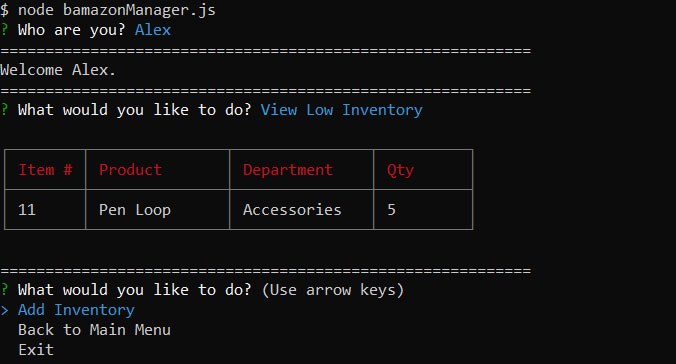
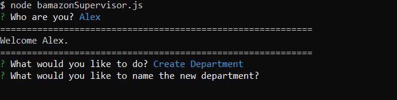

# Bamazon

## Overview

Check out this Amazon-like storefront created using MySQL. The app receives orders from customers and updates inventory.

### Customer View

`Shop all products`

`Shop by department`

### Manager View

`View Products`

`Add Products`

`View Low Inventory`

`Add Inventory`

### Supervisor View

`View Product Sales by Department`

`Create Department`

